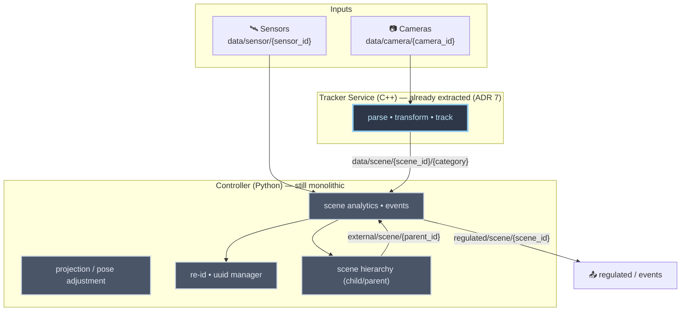
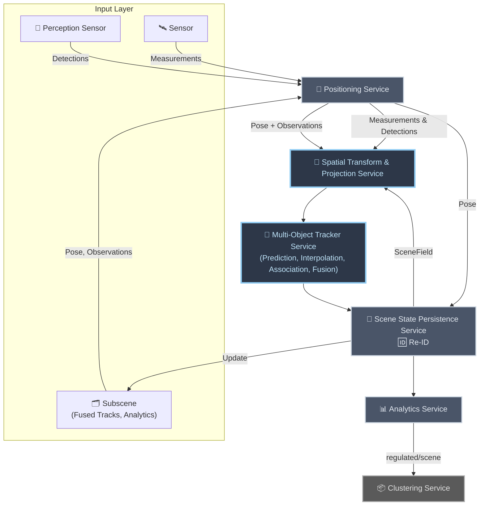

<!--
SPDX-FileCopyrightText: (C) 2026 Intel Corporation
SPDX-License-Identifier: Apache-2.0
-->

# ADR 13: Controller Breakdown into Functionality-Aligned Microservices

- **Author(s)**: [Tomasz Dorau](https://github.com/tdorauintc), [Sarat Poluri](https://github.com/saratpoluri), [Lukasz Talarczyk](https://github.com/ltalarcz), [Rob Watts](https://github.com/rawatts10)
- **Date**: 2026-06-11
- **Status**: `Accepted`

## TLDR

The Scene Controller still bundles several distinct responsibilities — spatial
transform/projection, multi-object tracking, scene analytics, re-identification,
and hierarchy aggregation — into one deployable unit. (Note: the Controller
maintains runtime state in memory but does not persist state; persistence is
handled by the Manager layer.)
The first step of decomposition, extracting the **Tracker Service** (ADR 7),
proved the model works. This ADR proposes completing the breakdown by carving
the remaining functionalities into independent, self-contained microservices
that communicate over well-defined interfaces (gRPC for synchronous,
latency-sensitive paths; MQTT for asynchronous streaming). The goal is
independent evolution, scaling, and testability per functionality, a clean
recursive scene hierarchy, and support for emerging inputs (moving cameras,
SLAM-localized robots/drones, LiDAR). The proposed target is **full
microservice separation**; projection's inter-service latency is called out as
an explicit risk to be measured, not a blocker.

## Context

### Where we are today

SceneScape began as a single monolithic **Controller** that performed
projection, tracking, analytics, event detection, and persistence in one
Python process (calling C++ via pybind11 for hot paths). ADR 7
([Tracker Service](./0007-tracker-service.md)) took the first decomposition
step: it extracted real-time multi-object tracking into a dedicated pure-C++
**Tracker Service**, leaving the remaining responsibilities in the Controller
(now effectively an analytics-and-everything-else service).

That first split validated the approach — a functionality with distinct
performance characteristics and a well-defined input/output contract can be
cleanly separated and scaled on its own. The Controller, however, still hosts a
heterogeneous mix of concerns that have little in common beyond historical
co-location.

### Responsibilities still bundled in the Controller

The current Controller couples functionalities with very different runtime
profiles, languages of choice, scaling needs, and rates of change:

- **Spatial transform & projection** — 2D camera detections into the shared 3D
  coordinate system, surface placement, raycasting, depth-inaccuracy
  correction, and object-type-specific heuristics.
- **Multi-object tracking (MOT)** — already extracted to the Tracker Service
  (see [`tracking.py`](../../controller/src/controller/tracking.py),
  [`ilabs_tracking.py`](../../controller/src/controller/ilabs_tracking.py) for
  the legacy in-Controller path).
- **Scene analytics & events** — regions, tripwires, sensor attribute fusion,
  sub-detection projection, and camera visibility
  (see [`scene_controller.py`](../../controller/src/controller/scene_controller.py)).
- **Re-identification (Re-ID)** — embedding storage, query/match, and global ID
  assignment (see [`reid.py`](../../controller/src/controller/reid.py),
  [`uuid_manager.py`](../../controller/src/controller/uuid_manager.py),
  [`vdms_adapter.py`](../../controller/src/controller/vdms_adapter.py)).
- **Scene hierarchy** — aggregating child ("sub-scene") results into parent
  scenes (see
  [`child_scene_controller.py`](../../controller/src/controller/child_scene_controller.py)).
- **Runtime state maintenance** — the Controller maintains current scene state
  (object positions, tracking data) in memory.

### Why break it down further

- **Mixed critical paths.** Latency-critical projection/tracking is interleaved
  with non-real-time analytics and persistence, so one cannot scale or be
  tuned without affecting the others.
- **Independent evolution.** Projection is growing substantially more complex
  with moving cameras (body-worn, drones), SLAM-localized robots, probabilistic
  placement with error bars, and object-type-specific projection (flying vs.
  ground). This logic should evolve on its own cadence, not gated by the
  Controller release.
- **New input modalities.** LiDAR and other 3D sensors, plus pose feeds from
  IMU/SLAM, require a clean separation between _positioning_ (calibration →
  pose) and _transform/projection_ (pose + observation → world coordinates).
  While calibration/mapping separation already exists today, ADR 13 formalizes
  it as a deployable service boundary with explicit pose/observation contracts,
  independent scaling and release cadence, and consistent integration into the
  recursive hierarchy path.
- **Well-defined contracts.** Once projection is its own service, the Tracker's
  input becomes a clean stream of observations already in the shared coordinate
  system — a precise, testable contract.
- **Recursive hierarchy.** Sub-scenes should feed parents through the same
  interfaces a scene exposes to its sources, so hierarchy is naturally
  recursive rather than special-cased.
- **Shared services.** Re-ID is consumed across scenes and should be a shared
  service rather than embedded per Controller instance. Separating Re-ID into
  its own service with a public API enables external clients to curate and
  inject entries (e.g., persons of interest) into the vector database,
  unifying vector data handling rather than keeping it opaque within the
  Controller.
- **Independent testability and fault isolation.** Each functionality can be
  validated, deployed, and fail independently.
- **Reduce coupling and maintenance burden.** While logically separate
  functionalities will remain coupled through shared contracts, explicit
  service boundaries make those couplings visible and manageable through
  versioning and contract evolution rather than hidden within a monolithic
  codebase. This reduces maintenance complexity and makes integration issues
  explicit rather than emergent.

### Current data flow

> Note: projection currently runs inside the Tracker path; the diagram groups
> the remaining Controller responsibilities to show what this ADR proposes to
> separate.

## Decision

Complete the decomposition of the Controller into **independent, self-contained
microservices**, each aligned to a single functionality and communicating over
explicit interfaces. We adopt **full microservice separation** as the target
(not a single-process, library-only split), while sequencing the work in phases
(see [Phased Implementation Plan](#phased-implementation-plan)) so that each
service is delivered and validated incrementally on top of the already-extracted
Tracker Service.

Interfaces follow the workload:

- **gRPC** for synchronous, latency-sensitive, query/response paths
  (positioning lookups, projection, Re-ID match/store).
- **MQTT** for asynchronous, fan-out streaming (observations, scene tracks,
  regulated output, events).

### Target architecture

### Services and responsibilities

Each entry below describes a deployable service boundary aligned with the target
architecture diagram.

#### Positioning Service

- **Role**: normalize and supply pose context for all incoming observations and
  measurements so that downstream services operate in a shared spatial frame.
- **Inputs**: perceptual sensor observations, sensor measurements,
  subscene-provided pose/observation updates.
- **Outputs**: pose-enriched context (pose + observations/measurements) for the
  Spatial Transform & Projection Service.
- **Communication**: request/response for pose retrieval and updates.
- **Technology**: Python for orchestration and integration with existing
  calibration tooling (`autocalibration/`); native math paths where throughput
  requires it.

#### Spatial Transform & Projection Service

- **Role**: transform observations into world-space coordinates using pose,
  including geometry-aware placement for non-flat environments (raycasting,
  intersection/normal checks, depth-inaccuracy correction, and object-type
  heuristics). On the critical real-time path; supports a lighter baseline mode
  for flat ground-plane deployments where complex geometry is not required.
- **Inputs**: pose plus observations and measurements from the Positioning
  Service, as well as scene mesh/scene field from scene state persistence layer
  for conditioning i.e projecting on surface.
- **Outputs**: world-space observations for the Multi-Object Tracker Service.
- **Communication**: low-latency synchronous path to the Tracker (co-locatable
  to minimize boundary overhead); asynchronous fan-out only where latency
  permits.
- **Technology**: C++ for the critical path, mirroring the Tracker's
  data-oriented design (see [ADR 7](./0007-tracker-service.md)).

#### Multi-Object Tracker Service (already extracted — ADR 7)

- **Role**: perform real-time multi-object tracking in 3D — prediction,
  interpolation, association, and fusion — producing reliable tracks with
  scene-local IDs.
- **Inputs**: world-space observations from the Spatial Transform & Projection
  Service.
- **Outputs**: streaming track updates to the Scene State Persistence Service.
- **Communication**: streaming/event output for continuous track updates; scene
  assignment managed via lease-based coordination with Manager in scaled
  deployments (see [ADR 8](./0008-tracker-service-horizontal-scaling.md)).
- **Technology**: pure C++, data-oriented design (see
  [ADR 7](./0007-tracker-service.md),
  [ADR 8](./0008-tracker-service-horizontal-scaling.md)).

#### Scene State Persistence Service (including Re-ID)

- **Role**: maintain authoritative, cross-restart scene state; own the
  Re-ID/identity persistence flow — embedding storage, UUID assignment and
  lifecycle, and VDMS integration — as represented by the combined
  `💾 Scene State Persistence / 🆔 Re-ID` block in the target architecture
  diagram. Scene DVR and full replay capabilities are future extensions not in
  near-term scope.
- **Inputs**: streaming track updates from the Tracker; pose from Positioning;
  identity features and track context for Re-ID match/store; state-query requests
  from downstream consumers.
- **Outputs**: SceneField (scene reconstruction (geometry + texture)) to the
  Spatial Transform & Projection Service; scene state updates to the Subscene
  layer; identity-enriched state to the Analytics Service (see
  [ADR 10](./0010-reid-metadata-storage-architecture.md),
  [ADR 11](./0011-inner-product-reid-state-and-id-lineage.md)).
- **Communication**: MQTT for track stream ingest; gRPC/REST for state and
  identity queries.
- **Technology**: Python service stack with storage-backed durability and
  integrated identity components (UUID manager, VDMS adapter).

#### Analytics Service

- **Role**: compute scene analytics and generate events (regions, tripwires,
  dwell time, camera visibility); successor to in-Controller analytics (the
  transitional Controller analytics-only mode has been removed).
- **Inputs**: identity-enriched state updates from Scene State Persistence.
- **Outputs**: `regulated/scene/{scene_id}` and `events/+` for downstream
  consumers.
- **Communication**: MQTT.
- **Technology**: Python; selective native optimization for compute-heavy
  analytics stages.

#### Clustering (existing downstream service)

- Cluster analytics remains an independent downstream service
  ([ADR 4](./0004-cluster-analytics-service.md)) consuming `regulated/scene`
  output. It is unchanged by this ADR and listed for completeness.

### Recursive hierarchy via sub-scenes

**Scene Graph**: the system maintains a hierarchical representation of spatial
data organized in Cartesian coordinate spaces, where each scene node is an
aggregator of its children. A node is aware only of its children's outputs; it
has no visibility into sibling scenes or parent scenes. This aggregation-only
design decouples hierarchy levels and simplifies the data model.

**Sub-scenes** (the general term for any child data source) include child
scenes with fused tracks and analytics, cameras observing within that scene's
frame, moving robots with SLAM-localized pose, drones, sensors, and perception
devices. All subscene types present their outputs through the same interface a
scene exposes to its external sources: **pose + observations**. This recursive
interface contract means hierarchy is _recursive by construction_ rather than a
special-cased path; parents and children speak the same language, and any node
can be both a parent (aggregating children) and a child (feeding a parent).

The outputs flowing upward — whether fused tracks and events from a child scene
or observations from a camera or sensor — carry global identities assigned by
the shared Re-ID Service. The first global UUID assigned to an identity at any
level in the hierarchy remains stable for that identity throughout the entire
hierarchy, ensuring ID consistency without reassignment across nested scenes.

### Design principles

- **Separation of concerns**: each service owns one functionality and a clean
  contract; services are unaware of hierarchy specifics.
- **Recursive design**: parents and children speak the same interface; no
  special hierarchy plumbing.
- **Performance first**: service boundaries must not degrade real-time
  performance — co-locate latency-critical services and choose gRPC/MQTT per
  workload; measure before committing (see
  [Open Questions](#open-questions)).
- **Well-defined contracts**: positioning emits pose, projection emits
  world-space observations, the Tracker emits tracks — each independently
  testable.
- **Shared, not duplicated**: cross-scene capabilities (Re-ID, Scene Graph) are
  shared services rather than per-instance copies.

## Alternatives Considered

### 1. Keep the monolithic Controller (do nothing further)

- **Pros**: no migration effort; single deployment; no inter-service latency.
- **Cons**: latency-critical and non-critical paths stay coupled; projection
  cannot evolve independently for moving cameras/SLAM/LiDAR; hierarchy and Re-ID
  remain special-cased and per-instance; scaling one concern means scaling all.
  Does not address the drivers in [Context](#context).

### 2. Optimize the monolith in place (better threading/processes, no split)

- **Pros**: smaller change; reuses existing code paths.
- **Cons**: cannot give each functionality its own language, scaling unit, and
  release cadence; the Python orchestration layer still couples projection,
  analytics, and persistence; does not produce the clean, independently testable
  contracts the breakdown is meant to deliver.

### 3. Library-first split within a single process (defer microservices)

Keep the functionalities as separate libraries linked into one (or few)
processes, with the _option_ to extract them into gRPC microservices later.

- **Pros**: avoids serialization/deserialization and network overhead initially
  (relevant for the latency-critical projection → tracking path); easier initial
  deployment.
- **Cons**: defers the separation-of-concerns and independent-scaling benefits;
  in practice shared-process coupling tends to leak (shared state, global
  config, build/release entanglement), making the eventual extraction harder.
- **Why rejected**: this ADR targets **full microservice separation** for the
  long-term architecture. The latency concern is real but bounded — prior
  benchmarking showed Protobuf over the wire improving latency by ~43% to below
  1 ms for the Tracker PoC ([PR #636][pr636]) — and is handled by _co-locating_
  latency-critical services and choosing gRPC vs. MQTT per path, plus measuring
  before committing (tracked in [Open Questions](#open-questions)), rather than
  by collapsing them into one process.

### 4. Extend the existing Cluster Analytics service to host scene analytics

- **Pros**: reuses an already-separate downstream service.
- **Cons**: conflates density-based clustering (a downstream consumer of
  regulated output) with core scene analytics/events, which have different
  inputs, latency profiles, and ownership.
- **Why rejected**: scene analytics is its own functionality with its own
  contract; clustering remains a distinct downstream service
  ([ADR 4](./0004-cluster-analytics-service.md)).

## Consequences

### Positive

- **Independent evolution**: projection, positioning, analytics, Re-ID, and
  persistence each move on their own cadence; projection can grow toward moving
  cameras/SLAM/LiDAR without gating the rest.
- **Independent scaling and fault isolation**: each functionality scales to its
  own bottleneck and fails in isolation.
- **Clean, testable contracts**: pose, world-space observations, tracks, and
  regulated output are explicit interfaces that can be validated in isolation.
- **Recursive hierarchy**: sub-scenes reuse the same interfaces as primary
  sources, removing special-cased hierarchy code.
- **Shared cross-scene services**: a single Re-ID Service and Scene Graph avoid
  per-instance duplication and keep global identities consistent up the
  hierarchy.
- **New modalities**: a dedicated Positioning Service gives LiDAR, robots, and
  drones a clean path into the shared coordinate system.

### Negative

- **More services to deploy and operate**: more images, configuration,
  inter-service auth/certs, and observability surface.
- **Inter-service latency**: the projection → tracking path is latency-critical;
  splitting it across a boundary adds serialization/transport cost that must be
  measured and mitigated (co-location, gRPC) — see
  [Open Questions](#open-questions).
- **Cross-service debugging complexity**: tracing a single detection now spans
  multiple services; requires solid distributed tracing
  ([ADR 2](./0002-controller-otel.md)).
- **Migration effort**: phased extraction and dual-running during transition add
  temporary complexity (see
  [Phased Implementation Plan](#phased-implementation-plan)).
- **Shared-service availability**: Re-ID, Scene Graph, and Positioning become
  cross-cutting dependencies whose availability affects multiple scenes.

## Open Questions

These are tracked as risks/decisions to resolve during the phased rollout; they
do not block adopting the target architecture.

- **Projection inter-service latency (risk)**: the Spatial Transform &
  Projection → Tracker path is latency-critical. Splitting it across a service
  boundary must be benchmarked (gRPC vs. MQTT, serialization cost, co-located vs.
  networked) before the boundary is finalized. Prior work measured Protobuf at
  ~43% latency improvement to below 1 ms for the Tracker PoC ([PR #636][pr636]);
  this needs to be re-validated end-to-end for projection. Mitigation if needed:
  co-locate projection with the Tracker, or fall back to a shared-process
  library boundary for this hop only.
- **Feedback Loop semantics**: the Tracker → projection feedback edge is
  proposed, not committed. Its purpose (e.g., refining placement priors for
  autonomous systems), contract (payload and timing), and activation criteria
  need definition before it becomes a phase deliverable.
- **Retracking redesign**: how parents handle child tracks — trust child tracks
  vs. retrack — including deduplication of overlapping child coverage and
  ensuring the first-assigned global UUID persists up the hierarchy. Current
  retracking causes unnecessary ID reassignment and mishandles active trackers
  (e.g., UWB); a decision may need to be object-type-based rather than
  scene-based.
- **Scene Graph ownership and consistency**: the Scene Graph is derived from
  scene state and delivered by the Persistence layer. Questions remain about
  consistency model across distributed services, ownership of the authoritative
  graph representation, and how pose updates from Persistence reconcile with
  Positioning.
- **Temporal fidelity control**: how a parent scene controls the data/update
  rate it receives from children.
- **Semantic clustering**: how to meaningfully group different object types,
  and the interface between analytics and the clustering service for it.
- **Transport selection per hop**: final gRPC-vs-MQTT choice for each interface,
  driven by the latency benchmarks above and MQTT throughput limits.

## Appendix

### Phased Implementation Plan

The breakdown is incremental and builds on the already-extracted Tracker
Service. Each phase delivers an independently deployable, validated service
while the legacy Controller continues to run behind feature flags until its
responsibilities are fully migrated. To avoid disconnected delivery, each
phase defines an explicit controller-parity target and a bounded legacy
Controller role.

| Phase    | Deliverable                                                                                                                                                              | Functionalities Supported (controller parity target)                                                                  | Role of legacy Controller (if any)                                                                                     |
| -------- | ------------------------------------------------------------------------------------------------------------------------------------------------------------------------ | --------------------------------------------------------------------------------------------------------------------- | ---------------------------------------------------------------------------------------------------------------------- |
| 0 (done) | Tracker Service extraction ([ADR 7](./0007-tracker-service.md), [ADR 8](./0008-tracker-service-horizontal-scaling.md))                                                   | Real-time MOT parity for prediction, interpolation, association, and fusion on extracted tracker path                 | Continues running analytics, hierarchy, Re-ID, and persistence paths                                                   |
| 1        | Scene State Persistence + shared Re-ID integration ([ADR 10](./0010-reid-metadata-storage-architecture.md), [ADR 11](./0011-inner-product-reid-state-and-id-lineage.md)) | Authoritative state, identity lineage, and cross-restart parity for scene state and ID lifecycle                      | Continues serving analytics APIs that still depend on legacy state views                                               |
| 2        | Shared Scene Graph foundation                                                                                                                                            | Canonical scene-node model, parent/child topology, transform ownership boundaries, and graph query contract           | Remains source for runtime hierarchy behavior while publishing/consuming graph metadata through compatibility adapters |
| 3        | Spatial Transform & Projection Service                                                                                                                                   | Projection/pose-adjustment parity for world-space observation output to tracker; transport and latency gate validated | Keeps fallback projection path behind feature flags for controlled cutover                                             |
| 4        | Analytics Service extraction                                                                                                                                             | Analytics/events parity on persistence-backed, identity-enriched state                                                | Runs only non-migrated edge cases behind feature flags                                                                 |
| 5        | Positioning Service rollout                                                                                                                                              | Calibration-to-pose parity for cameras, sensors, and mobile platforms, with pose contract consumed by projection path | Retains temporary pose adapter and non-migrated sensor handling                                                        |
| 6        | Dedicated hierarchy migration phase                                                                                                                                      | Recursive sub-scene hierarchy parity using shared scene interfaces and first-assigned global UUID persistence rules   | Legacy hierarchy path remains read-only fallback until validation gates pass                                           |
| 7        | Feedback Loop decision (if adopted) and monolith retirement                                                                                                              | Final parity closure, optional feedback contract integration, and complete service-path operation                     | Retired after parity, performance, and reliability gates are satisfied                                                 |
