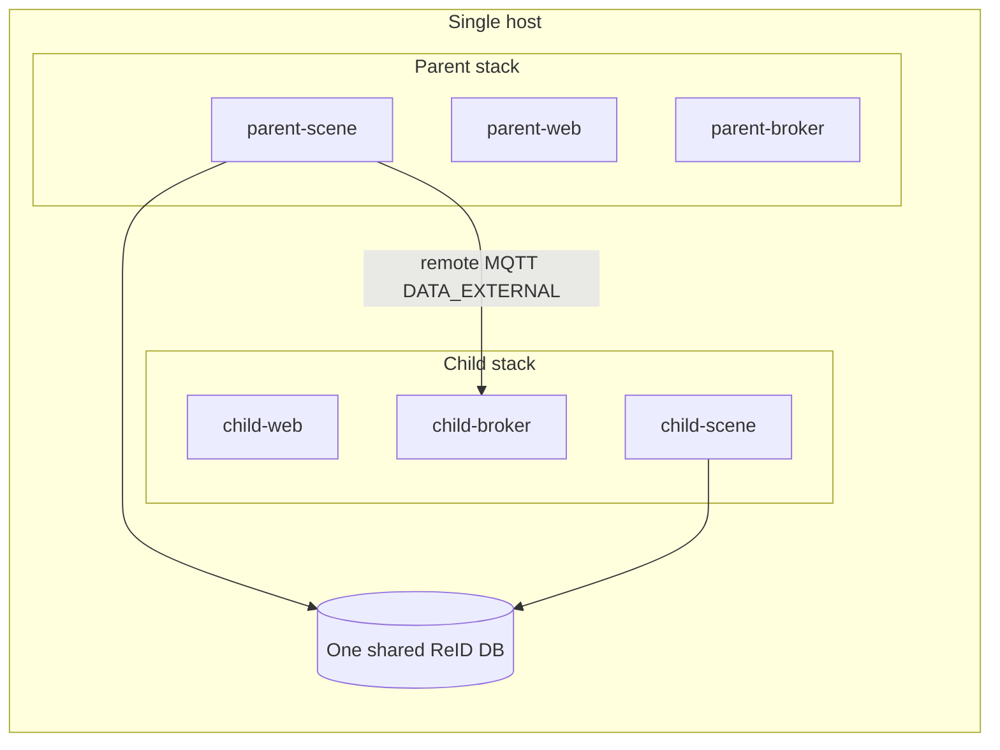

# Deploy Multiple Scene Controllers on One Host

A [scene hierarchy](./configure-hierarchy-of-scenes.md) can use **local** children
(same Scene Controller) or **remote** children (separate Scene Controllers linked
over MQTT). This guide covers the remote case when every controller runs on the
**same machine**.

By completing this guide, you will:

- Understand when you need more than one Scene Controller on one host.
- Co-locate parent and child stacks without port or certificate collisions.
- Apply the **supported** ReID rules: unrelated scenes may share a DB or use
  separate instances; in a hierarchy avoid split backends, allow parent-only
  ReID when children only passthrough embeddings.

---

## When You Need Multiple Controllers

| Goal | Use |
|------|-----|
| Nested floor plans / ROIs under one tracker and one ReID process | **Local** child scenes on one controller (preferred) |
| Separate Manager DBs / brokers per site while one parent aggregates | **Remote** children; share one ReID if children enroll, or parent-only ReID if children only forward embeddings |

Prefer **local** children whenever a single controller can own the hierarchy.
Use remote children only for operational isolation (separate stacks), not to
invent mixed ReID topologies.

On one host, remote children still use the same remote-child link UI and MQTT
`DATA_EXTERNAL` path as controllers on different machines. The only difference
is networking: publish unique host ports and give each service a stable DNS
name on a shared Docker network.



---

## Prerequisites

- Docker Compose and Scenescape images built or pulled (`make build-core` or
  prebuilt containers).
- Ability to edit Compose files (or use prefixed service fragments).
- Familiarity with [remote child linking](./configure-hierarchy-of-scenes.md#steps-to-add-a-remote-child-scene)
  and, if using identity matching,
  [enabling ReID](../../other-topics/how-to-enable-reidentification.md).

---

## Recommended Layout: One Compose Project, Prefixed Services

Prefer **one Compose project** with role-prefixed services
(`parent-web`, `child1-broker`, …) on one Docker network. That avoids two
stacks both claiming host ports `443` / `1883` / `55555`.

A working reference used by functional tests lives under
[`tests/compose/hierarchy/`](https://github.com/open-edge-platform/scenescape/tree/main/tests/compose/hierarchy).
Those fragments are test-oriented but illustrate the same deployment rules.

### 1. Give Each Role Unique Host Ports

Publish different host ports for every web UI and MQTT broker you will reach
from the host (browsers, pytest, `mosquitto_pub`):

```bash
export PARENT_WEB_PORT=8443
export PARENT_BROKER_PORT=18883
export CHILD1_WEB_PORT=8444
export CHILD1_BROKER_PORT=18884
# If you expose ReID to the host:
export REID_SHARED_PORT=55555
```

Inside the Docker network, services still talk on container ports (`443`,
`1883`, `55555`). Only the **host** mappings must be unique.

### 2. Use Stable DNS Aliases on a Shared Network

Attach every service to one network (for example `scenescape`) and set aliases
such as:

- `parent-web.scenescape.intel.com` / `parent-broker.scenescape.intel.com`
- `child1-web.scenescape.intel.com` / `child1-broker.scenescape.intel.com`
- `reid.scenescape.intel.com` (or `reid-shared.scenescape.intel.com`) when sharing ReID

Add matching lines to the host `/etc/hosts` (or your test harness host-alias
list) so tools on the host can resolve those names to `127.0.0.1` and use the
published ports.

### 3. Share Secrets (Simplest on One Host)

On a single machine, the simplest trust model is **one secrets directory** for
all controllers:

- One CA (`scenescape-ca.pem`)
- One web TLS cert/key (with SANs for every `*-web` hostname)
- One broker TLS material (with SANs for every `*-broker` hostname)
- One `controller.auth` / `browser.auth` for MQTT and REST automation
- Shared ReID client/server certs when any controller uses ReID

Generate certificates with extra hostnames via `BROKER_EXTRA_HOSTS` /
`WEB_EXTRA_HOSTS` / `REID_S_EXTRA_HOSTS` (empty by default in
`tools/certificates`; the repo root `make certificates` / `init-secrets`
passes hierarchy aliases for tests):

```bash
make certificates
# Or explicitly:
make -C tools/certificates deploy-certificates CERTPASS=<passphrase> \
  BROKER_EXTRA_HOSTS='parent-broker child1-broker child2-broker' \
  WEB_EXTRA_HOSTS='parent-web child1-web child2-web' \
  REID_S_EXTRA_HOSTS='reid-shared reid-a reid-b'
```

For minimal SANs without hierarchy names:

```bash
make certificates BROKER_EXTRA_HOSTS= WEB_EXTRA_HOSTS= REID_S_EXTRA_HOSTS=
```

Regenerate after changing SAN lists so TLS hostname checks succeed for every
alias.

> **Note:** Separate CA/auth per controller is possible but heavier: you must
> still arrange mutual MQTT TLS trust for the parent’s remote-child connection.
> Shared secrets are the usual choice for a lab or single-host demo.

### 4. One NTP Source

Time skew drops or delays hierarchy MQTT frames. Run **one** NTP service (on
the parent stack) and point every scene controller (and video pipeline, if any)
at that hostname. Do not run independent NTP servers per child on the same host
unless you know they stay synchronized.

### 5. Separate Persistence Per Controller

Each controller role needs its own:

- PostgreSQL volume (Manager metadata / scenes / cameras)
- Media / migrations volumes as required by Manager
- MQTT broker instance

Do **not** share one Manager database across two Scene Controllers. Scene and
camera UUIDs must remain unique for remote links: if two stacks both load the
same Demo fixture UUID, create a dedicated scene (and camera) on each child
before linking, or clear duplicate scenes.

### 6. Link Children as Remote

From the **parent** UI (or REST API):

1. Open the parent scene → **Children** → **+ Link Child Scene**.
2. Set **Child Type** to `Remote`.
3. Set **Hostname** to the child’s broker alias (for example
   `child1-broker.scenescape.intel.com`), not the host’s LAN IP, when both
   stacks share the Docker network.
4. Enter MQTT username/password from the shared (or child) `controller.auth`.
5. Set transform / **Retrack** as for any remote child.
6. Confirm the child status topic reports connected
   (`scenescape/sys/child/status/<remote_child_id>`).

Full UI steps: [Add a remote child scene](./configure-hierarchy-of-scenes.md#steps-to-add-a-remote-child-scene).

---

## ReID Across Controllers (What Is Supported)

ReID runs **inside each Scene Controller** (`REID_DATABASE`, client certs, vector
DB). Controllers do not inherit ReID from a parent scene link.

### Unrelated scenes: share a DB or use separate instances

Two scenes (or two Scene Controllers) that are **not** linked as parent/child
may:

- **Share** one vector database — common identity pool across independent
  floors/buildings/demos; each scene enrolls from its own cameras; or
- **Use separate ReID instances** — fully isolated identity spaces.

Neither choice requires a hierarchy link. Hierarchy rules below apply only when
scenes **are** parent/child and you care how identity moves across that link.

### Who enrolls vs who only queries

| Observation | Enrolls into the ReID DB? | May query the ReID DB? |
|-------------|---------------------------|-------------------------|
| Detection from a **camera on this controller** (pixel bbox passes `minimum_bbox_area`) | **Yes** (this scene owns the crop) | Yes |
| Detection **forwarded from a child** (`retrack=True`) with vetted provenance | **Yes** when this scene has ReID **and** upstream did **not** claim `will_enroll` / `enrolled`: sole enroll on query-no-match; **enhance** the matched UUID's cluster after rematch. When the child stamps those write-authority flags, the parent still **queries** but must **not** write | Yes, if this controller has ReID |
| Forwarded child detection with `retrack=False` | No | No (reid stripped; child id kept) |

So a **parent camera** always enrolls on the parent. A **child camera** crop is
enrolled by a child with ReID when present; otherwise a parent with ReID may
sole-enroll that forwarded crop after a miss, and after a rematch may keep
**enhancing** that UUID's embedding cluster (like additional camera views).

### Write authority on the hierarchy wire (`will_enroll` / `enrolled`)

When a child Scene Controller runs ReID (TLS client certs mounted, or
`REID_USE_TLS=false` for an explicit non-mTLS ReID deployment), it publishes
write-authority flags on hierarchy reid provenance.

**Deploy note:** keep parent-only / passthrough children on the TLS default
(`REID_USE_TLS=true`) **without** mounting ReID client certs. Setting
`REID_USE_TLS=false` is treated as write intent even with default hostname/DB
env vars.

| Child publish state | Local `metadata.reid` on hierarchy | Parent write behavior |
|---------------------|------------------------------------|------------------------|
| Schema not ready, or no successful DB write yet | **Withheld** (inherited vetted reid still relays) | Cannot sole-enroll those early local frames |
| Schema ready **and** at least one successful `addEntry` | Forwarded; `will_enroll` / `enrolled` stamped **per track** that owns or is accumulating a write | Query yes; **skip** sole-enroll / enhance for claimed crops; short tracks without a claim remain parent-enrollable |
| ReID DB writes failing **before** any confirmed write | Forwarded **without** `will_enroll` (passthrough); child **stops** local enrollment | Parent may sole-enroll |
| Confirmed write, then later write failures / reid disable | Keep will_enroll **mode**; per-track claims only for tracks that still own a write | Skip claimed crops; may sole-enroll unclaimed ones |
| Empty/invalid vector batch **before** first confirm | Passthrough; child **stops** local enrollment | Parent may sole-enroll |
| No ReID write intent (typical parent-only child: TLS default on, **no** ReID client certs) | Forwarded without `will_enroll` | Parent may sole-enroll |

Details and edge cases (empty vector batches, cancelled flushes, multi-hop
relays): [ADR 0015](../../../adr/0015-hierarchy-reid-provenance.md).

### Retrack when using ReID in a hierarchy

Children assign each track its own object UUID before forwarding. What the
parent does with that depends on **Retrack**:

| Retrack | Parent behavior | Identity outcome with ReID |
|---------|-----------------|----------------------------|
| **Off** | Keeps the child’s UUID; **strips** forwarded reid; does not run parent UUID/ReID on that object | **No fusion.** If the child also enrolled under that UUID and the parent later enrolls the same person from a **parent camera**, the shared DB can hold **separate UUIDs** for one person. |
| **On** | Re-tracks; **queries** with provenance; sole-enrolls on no-match; enhances matched UUID clusters with further forwarded vectors | Parent rematches IDs already in the DB, or becomes sole enroller when children have no ReID. |

**Recommendation:** if the hierarchy uses ReID and you care about a single
identity space across children and parent cameras, **enable Retrack** on those
child links. Leaving Retrack off is appropriate when you want the child’s IDs
authoritative and do **not** expect parent-level ReID fusion.

### Hierarchy: supported ReID layouts

| Configuration | When to use |
|---------------|-------------|
| **No ReID anywhere** in the hierarchy | Tracking / ROIs only |
| **Shared ReID on parent and every camera-owning child** | Children rematch locally **and** enroll; they stamp `will_enroll` after the first successful write so the parent queries the same DB **without** re-enrolling the same crop |
| **ReID on parent only; children forward embeddings** (no child ReID) | Children passthrough detector embeddings + provenance (no `will_enroll`); parent queries and **enrolls on no-match** under parent UUIDs |
| **Local** children on one controller with that controller’s ReID | Preferred single-process hierarchy |

**Parent-only ReID (children as passthrough)** is supported when:

- Each child still publishes hierarchy reid with vetted provenance for
  qualifying crops (embedding passthrough — not a child vector-DB client); and
- **Retrack** is on so the parent runs UUID/ReID on forwarded objects. The
  parent enrolls child-only crops when the DB has no row yet, then rematches
  siblings sequentially to that UUID.

When children **do** need local rematch/enrollment, put them on the **same**
shared backend as the parent so sibling enrollments do not fork into separate
identity spaces.

Supported shared-DB wiring (every controller that uses that instance):

```yaml
environment:
  REID_DATABASE: VDMS          # or QDRANT — same value for that shared instance
  REID_HOSTNAME: reid.scenescape.intel.com
  REID_PORT: "55555"
  REID_USE_TLS: "true"
```

Mount matching ReID client certificates. The DB needs a network alias matching
`REID_HOSTNAME` and matching server-cert SANs.

For hierarchy rematch with a shared backend, **enable Retrack** (see
[above](#retrack-when-using-reid-in-a-hierarchy)). Durable continuity across
children that enroll is primarily **sequential** rematch
([ADR 0015](../../../adr/0015-hierarchy-reid-provenance.md#how-should-two-live-parent-tracks-share-one-reid-database-identity)).

### Hierarchy: unsupported ReID mixes

| Avoid **inside one hierarchy** | Why |
|--------------------------------|-----|
| **Split ReID databases** on different children (or child vs parent) when you expect one identity space | Enrollments do not join; parent cannot rematch across DBs |
| **Some children on DB A, others on DB B** (or only some children on a DB) while expecting unified people at the parent | Competing / partial identity spaces |
| **Children with ReID, parent without**, when you expect the parent to rematch via the DB | Parent never queries |
| **Retrack off** on ReID hierarchies when you also expect parent cameras and children to share one durable UUID | No fusion; child enrollments and parent-camera enrollments can fork into separate DB UUIDs |
| Mixing **VDMS and Qdrant** among controllers that should share one identity space | Not one backend |

Isolated identity for unrelated sites: give them **separate** ReID instances (or
share one deliberately)—no hierarchy required either way.

### Backend choice

VDMS and Qdrant remain mutually exclusive **per vector-database instance**. Every
controller that shares one instance must use the same `REID_DATABASE` value and
hostname for that instance.
[Selecting the ReID vector database backend](../../other-topics/how-to-enable-reidentification.md#selecting-the-reid-vector-database-backend).

See also [Embeddings in a Scene Hierarchy](../../microservices/controller/Extended-ReID.md#embeddings-in-a-scene-hierarchy).

---

## Alternative: Multiple Compose Projects

You can run `COMPOSE_PROJECT_NAME=parent` and `COMPOSE_PROJECT_NAME=child1` as
separate projects if you:

- Remap **all** conflicting published ports.
- Attach both projects to an **external** Docker network and use aliases or
  reachable hostnames.
- Share or trust certificates as above.
- Point child NTP at the parent NTP container or host.

Prefixed services in one project are usually easier to operate on a single
machine.

---

## Validation Checklist

- [ ] Each web UI opens on its own host port with a valid TLS name.
- [ ] Each broker accepts MQTT with the expected auth and CA.
- [ ] Parent remote-child status is connected for every child.
- [ ] Parent regulated MQTT shows child objects after transform.
- [ ] ReID for unrelated stacks: shared DB **or** separate instances, as needed.
- [ ] Inside a hierarchy: no split backends across children when unifying
      identity; parent-only ReID (children passthrough) enrolls child-only crops
      on query-no-match; when children need local rematch, share one backend and
      confirm children stamp `will_enroll` after they can write (parent must not
      double-enroll the same crop).
- [ ] If the hierarchy uses ReID and you want one identity space, **Retrack is
      on** for those child links (Retrack off → no fusion; risk of separate DB
      UUIDs from child vs parent-camera enrollments).
- [ ] Clocks stay aligned (single NTP or equivalent).

---

## Related Documentation

- [Configure a hierarchy of scenes](./configure-hierarchy-of-scenes.md) — local vs remote linking, retrack, rates
- [How to enable re-identification](../../other-topics/how-to-enable-reidentification.md) — single-stack ReID enablement
- [Extended ReID](../../microservices/controller/Extended-ReID.md) — provenance and enrollment policy
- [ADR 0015: Hierarchy ReID provenance](../../../adr/0015-hierarchy-reid-provenance.md) — design rationale
- Test compose reference: `tests/compose/hierarchy/`
- Functional coverage: `tests/functional/test_hierarchy_reid_db_scope.py`
- Agent fixture notes: [multi-controller hierarchy fixtures](../../../../.github/skills/testing/references/functional-tests.md#multi-controller-hierarchy-fixtures)
